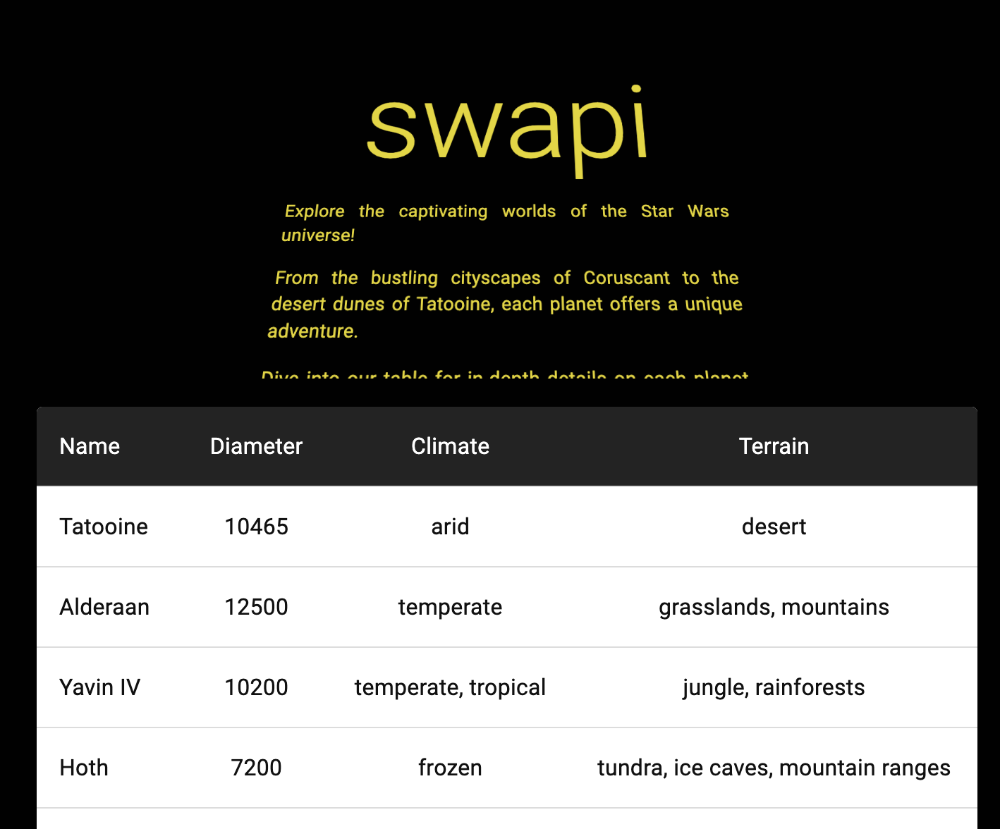

# SWAPI Application

## Installation
1. Clone the repository `https://github.com/GabrielaGodek/swapi.git` and open _swapi_ folder
2. Run docker container with `npm run docker` command in your terminal.
3. Open your browser and open `http://localhost:8080/`

## Dependencies

- vite: `^5.1.4`
- react: `^18.2.0`
- react-router-dom: `^6.22.2`
- typescript: `^5.2.2`
- @mui/material: `^5.15.11`
- bootstrap: `^5.3.3`
- sass: `^1.71.1`

## Data Storage Choice: localStorage vs Redux

During the design phase of the React project, a decision was made regarding how to store application data. In this context, two main approaches were considered: using localStorage and utilizing Redux. Ultimately, the decision was made to use localStorage for the following reasons:

1. **Implementation simplicity and dependency minimization**
   LocalStorage offers a straightforward interface for storing data in the browser. Redux is a powerful tool for managing application state, but its usage can lead to overengineering, especially for simple applications. Choosing localStorage helps avoid additional dependencies and keeps the codebase more transparent and understandable. _It is suitable with KISS principle._
2. **Data security:**
   Data stored in localStorage is persistently saved on the user's device, meaning it isn't lost after a page refresh or browser closure. This ensures data continuity even in the event of application failure.
3. **Performance:**
   Storing data directly in localStorage may contribute to improved application performance by reducing the number of state synchronization operations between Redux and localStorage.

## Preview

## Author

Gabriela Godek
